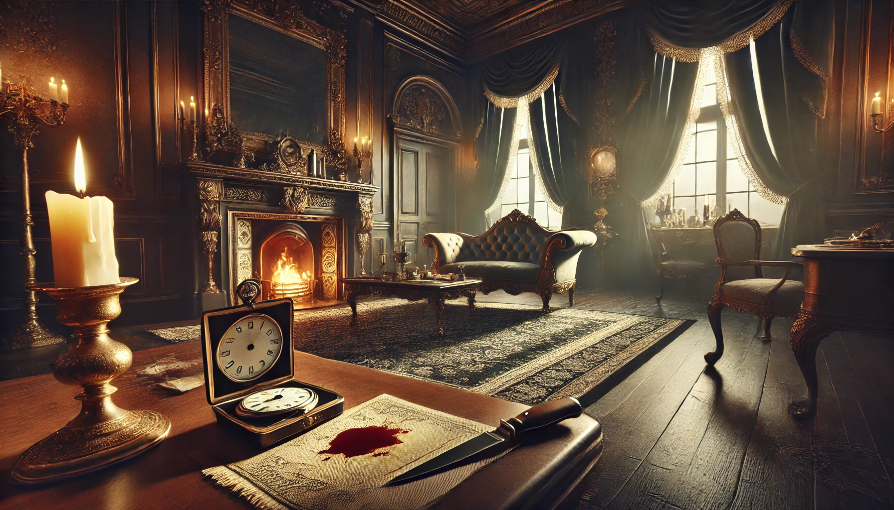
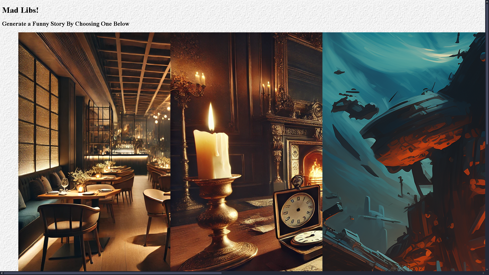

# Mad Libs


## What is Mad Libs?

You might have played it before where it is a word game that consists of a player prompting others for a list of words to fill in the blanks of a story before reading it outloud. In this project you will be using functions to create stories and prompting users (yourself or others) to enter input based on the story. These inputs could be adjectives, nouns, verbs, vehicles, food items, etc.


## Part I: HTML

### Step 1
In `index.html` create a div tag with a class and name it `container`. Here is a reminder of what a div tag with a class looks like:
```html
<div class="classNameGoesHere">
    <!-- Some Code -->
</div>
```
Inside that div tag create 3 other div tags with class category. These will represent your 3 different stories.

> [!NOTE]
> If you want to know if you're on the right track, below is the solution to step 1. These solutions will be at the end of every step to ensure you understand it and your website functions as expected.

<details>
<summary>Step 1 Solution</summary>

```html
<!-- Start writing code below -->
<div class="container">
    <div class="category">
        <!-- Implement in Step 2 -->  
    </div>

    <div class="category">
        <!-- Implement in Step 3 -->  
    </div>
  
    <div class="category">
        <!-- Implement in Step 4 -->  
    </div>
</div>
```
</details>

### Step 2
For each of these divs, add an ```img```, a ```p```, and a ```button``` element, to make **nine** in total.

In the first of the div tags:
- Add `dinner.jpg` to the img's source, it's located in the images folder.
> [!NOTE] 
> Remember from week 2 that talks about file paths? Find a file path to go from the images folder then to the `dinner.jpg` image. Once you found the path, put it in `src` of the image tag.

> [!TIP]
> You know that you got the correct path when the image is shown on your website.
- Set the alt to dinner.
- Paste the following in the ``<p>`` tag:
```plaintext
You have been invited to the most bizarre dinner party in town filled with unexpected twists, peculiar foods, and outrageous events.
```
- Paste the following in the ``<button>`` tag:
```plaintext
Generate Dinner Story!
```

<details>
<summary>Step 2 Solution</summary>

```html
<div class="category">
    
    <p>You have been invited to the most bizarre dinner party in town filled with unexpected twists, peculiar foods, and outrageous events.</p>
    <button>Generate Dinner Story!</button>
</div>
``` 
</details> 

> [!IMPORTANT]
> If you can understand step 2 then step 3 and 4 will be easy since it is the basically the same.

### Step 3
- In another div tag:
    - Add `mystery.jpg` to the img's source.
    - Set the alt to mystery.
    - Paste the following in the ``<p>`` tag:
    ```plaintext
    Enter the world of cobblestone streets, candlelit mansions, and peculiar characters, where a shocking crime shakes Victorian high society. A dashing yet delightfully unconventional detective must piece together the puzzle, navigating a cast of absurd suspects and hilariously bizarre clues.
    ```
    - Paste the following in the ``<button>`` tag:
    ```plaintext
    Generate Mystery Story!
    ```
<details>
<summary>Step 3 Solution</summary>

```html
<div class="category">
    
    <p>Enter the world of cobblestone streets, candlelit mansions, and peculiar characters, where a shocking crime shakes Victorian high society. A dashing yet delightfully unconventional detective must piece together the puzzle, navigating a cast of absurd suspects and hilariously bizarre clues.</p>
    <button>Generate Mystery Story!</button>
</div>
```
</details>

### Step 4
- In the last div tag:
    - Add `time_travel.jpg` to the img's source.
    - Set the alt to travel.
    - Paste the following in the ``<p>`` tag:
    ```plaintext
    Your malfunctioning time machine has created total chaos in the space-time continuum! Someone has used it to steal your homework before it was even due. It is up to you to travel through time and get it back before the bell rings for class.
    ```
    - Paste the following in the ``<button>`` tag:
    ```plaintext
    Generate Time Travel Story!
    ```

<details>
<summary> Step 4 Solution </summary>

```html
<div class="category">
    
    <p>Your malfunctioning time machine has created total chaos in the space-time continuum! Someone has used it to steal your homework before it was even due. It is up to you to travel through time and get it back before the bell rings for class.</p>
    <button>Generate Time Travel Story!</button>
</div>
```
</details>

### Step 5
- _**Outside the big container div**_ that holds the three category divs, create an `h1` tag with the text:
```plaintext
Your Generated Story
```
- Lastly, create another `div` right below it with the id "output". You can leave it blank for now.

<details>
<summary>Step 5 Solution</summary>

```html
<h1>Your Generated Story</h1>
<div id="output"></div>
```

</details>


## Part II: CSS
For now your website will look kind of funky with big images and text not aligning properly, something like this:



We'll use CSS to tidy things up!

### Step 6
In `style.css` we want the headers (the ``<h1>`` and ``<h2>`` tags) to be in the center of our website (Hint: Use Flexbox!).
  
<details>
<summary> Step 6 Solution </summary>

```css
h1, h2 {
    display: flex;
    justify-content: center;
}
```
</details>

### Step 7
Alright the images are way to big, we need to resize it. 
> [!NOTE]
> To change the style of all the images you can target the img tag (similar to the h1 and h2 tags).
- Style all images to have the following:
  - `width` of 100%
  - `height` set to auto.
  - `border-radius` to about 25 pixels.
      - This will round the corners for images.
  - `margin-bottom` to about 10 pixels. 
      - This will help space between the images and text.

<details>
<summary> Step 7 Solution </summary>

```css
img {
  width: 100%; 
  height: auto; 
  border-radius: 25px; 
  margin-bottom: 10px; 
}
```
</details>

### Step 8
- Style all paragraphs ``<p>`` to have the following:
    - `font-size` of 16 pixels.
    - `line-height` of 1.5.

<details>
<summary> Step 8 Solution </summary>

```css
p {
    font-size: 16px; 
    line-height: 1.5; 
}
```
</details>

### Step 9
- Style all buttons ``<button>`` to have the following:
    - `padding` of 10 pixels.

<details>
<summary> Step 9 Solution </summary>

```css
button {
    padding: 10px;
}
```
</details>

### ---- Feel free to change any of the values or add additional styling elements! ----

After all that, your website should look similar to this:


## Part III: JavaScript
In the `script.js` you will implement 3 functions that will be added to the onclick event in the `index.html` file.

### Step 10
- Create a function named `dinner` with no parameters.
```javascript
function dinner() {
  
}
```
- Inside the dinner function you will create variables that takes in user input by using the `prompt` method which looks something like this:
```js
let varName = prompt("Question goes here...");
```
- Create 8 variables that prompts the users to enter the following (in parentheses) from this story:
```plaintext
The dinner party started with a dish of (FOOD) that smelled like (SOMETHING STRANGE). 
Suddenly, a (ADJECTIVE) (ANIMAL) appeared and started (VERB)ing on the table! 
The host grabbed a (OBJECT) and yelled "(FUNNY QUOTE)!" 
We all laughed and said "(ANOTHER FUNNY QUOTE)." It was unforgettable!
```
- Here is an example of what your variables should look like:
```js
let food = prompt("Name a food");
```
> [!TIP]
> It is common practice to have "good" variable names related to what the variable is doing. Here is an example:
```js
let name = "Kai"; //a good variable name
console.log("Hello " + name + "!"); //we know that this greets the user with their name
// -------------------- \\
let z = "Josh"; //a bad variable name
console.log("How are you " + z + "?"); //what is z suppose to mean? Is it suppose to be a name, a continuation of a statement, an object?
```

<details>
<summary> Step 10 Solution </summary>

```js
function dinner()
{
  //it does not have to be the same variable name nor prompt
  let food = prompt("Food");
  let smthStrange = prompt ("Something Strange");
  let adj = prompt("Adjective");
  let animal = prompt("Animal");
  let verb = prompt("Verb");
  let obj = prompt("Object");
  let funQuote1 = prompt("A Funny Quote");
  let funQuote2 = prompt("Another Funny Quote");

}
```
</details>

### Step 11
- After prompting the user for each word in our Mad Lib sentence, we combine it together to create a full story, and update the output div. Add this line of code to the end of your function:
- ```js
  document.getElementById("output").innerHTML = `
  <p>The dinner party started with a dish of (FOOD) that smelled like (SOMETHING STRANGE). 
  Suddenly, a (ADJECTIVE) (ANIMAL) appeared and started (VERB)ing on the table! 
  The host grabbed a (OBJECT) and yelled "(FUNNY QUOTE)!" 
  We all laughed and said "(ANOTHER FUNNY QUOTE)." It was unforgettable!</p>
  `;
  ```
- You don't need to know what everything does but basically it finds the HTML element with an id of output, then the `.innerHTML` replaces the contents inside the element with a new string of HTML.

    - So if my JavaScript was:
    - ```js
      document.getElementById("output").innerHTML = `<p> Hello World </p>`;
      ```

    - The HTML will go from this:
    - ```html
      <div id="output"></div>
      ```
    - To this:
    - ```html
      <div id="output">
        <p> Hello World </p>
      </div>
      ```
- Remove the parentheses including everything inside the parentheses and replace it with `${yourVariableName}`
  - Adding a ```$``` symbol followed by curly braces lets you replace text in a string with text in a variable instead. So if I had set ```let name = "Ben"```, then ```alert("Hello ${name}!")``` would show as "Hello Ben!".
  - So for example, replace ```(FOOD)``` with ```${food}```, if food is the name of the variable holding the food word.
- This will replace the parentheses with the given user input.
- Do this for all 8 of the other placeholders.

<details>
<summary>Step 11 Solution</summary>

```js
document.getElementById("output").innerHTML = `
    <p>The dinner party started with a dish of ${food} that smelled like ${smthStrange}. 
    Suddenly, a ${adj} ${animal} appeared and started ${verb}ing on the table! 
    The host grabbed a ${obj} and yelled "${funQuote1}!" 
    We all laughed and said "${funQuote2}." It was unforgettable!</p>
    `;
```
</details>

### Step 12
Test your code! Go back to ```index.html``` and look for the button that's in the dinner div. Add the onclick property to the button, and set it equal to the function that you just made!
```html
<button onclick="dinner()">Generate Dinner Story!</button>
```
Now, presing this button activates your code!

### Once you got this down, doing the next 2 functions will be fairly easy.

### Step 13
- Create a function named `mystery` with no parameters.
- Create 11 variables that prompts the users to enter the following (in parentheses) from this story:

```plaintext
On a(n) (ADJECTIVE) night in the grand (PLACE), a loud (SOUND) revealed Lord (SILLY NAME 1) lying beside a (OBJECT), muttering, "It was the (NOUN)!"
Detective (NAME), questioned the (JOB TITLE), who was caught (VERB)ing near the scene. But the truth was stranger than fiction.
It turns out Lord (SILLY NAME 1) had slipped on (SUBSTANCE) while trying to steal a plate of (FOOD).
Everyone laughed, and the detective vowed to investigate only serious cases from now on.
```

<details>
<summary>Step 13 Solution</summary>

```js
//it does not have to be the same variable name nor prompt
function mystery()
{
  const adj = prompt("Adjective");
  const place = prompt("Place");
  const sound = prompt("Sound");
  const silName = prompt("A Silly Name");
  const obj = prompt("An Object");
  const noun = prompt("A Noun");
  const name = prompt("A Name");
  const jobTitle = prompt("A Job Title");
  const verb = prompt("Verb");
  const sub = prompt("A Substance");
  const food = prompt("Food");
}
```
</details>

### Step 14
- Update the output text to show this story, making sure to replace the words in parantheses with ```${variableName}```:

```js
document.getElementById("output").innerHTML = `
  <p>On a(n) (ADJECTIVE) night in the grand (PLACE), a loud (SOUND) revealed Lord (SILLY NAME 1) lying beside a (OBJECT), muttering, "It was the (NOUN)!"
  Detective (NAME), questioned the (JOB TITLE), who was caught (VERB)ing near the scene. But the truth was stranger than fiction. 
  It turns out Lord (SILLY NAME 1) had slipped on (SUBSTANCE) while trying to steal a plate of (FOOD).
  Everyone laughed, and the detective vowed to investigate only serious cases from now on.</p>
  `;
```

<details>
<summary>Step 14 Solution</summary>

```js
//assuming the variables are the same in step 13
document.getElementById("output").innerHTML = `
  <p>On a(n) ${adj} night in the grand ${place}, a loud ${sound} revealed Lord ${silName} lying beside a ${obj}, muttering, "It was the ${noun}!"
  Detective ${name}, questioned the ${jobTitle}, who was caught ${verb}ing near the scene. But the truth was stranger than fiction.
  It turns out Lord ${silName} had slipped on ${sub} while trying to steal a plate of ${food}.
  Everyone laughed, and the detective vowed to investigate only serious cases from now on.</p>
  `;
```
</details>

Add the "mystery()" function to the second button in your HTML.

### Step 15
- Lastly create a function named `travel` with no parameters.
- Create 9 variables that prompts the users to enter the following (in parentheses) from this story:

```plaintext
Your time machine malfunctions, and a (HISTORICAL FIGURE) steals your homework escaping to (PLACE)!
Armed with a (OBJECT), you chase them through time, dodging (PLURAL NOUN) and a (ADJECTIVE 1) dinosaur trying to (VERB) you.
You finally catch the thief at the (HISTORICAL PLACE) and grab your homework just time.
Back in class, your teacher, (SILLY NAME), says, "That's the most (ADJECTIVE 2) excuse ever!" But hey, you got an A!
```

<details>
<summary>Step 15 Solution</summary>

```js
function travel()
{
  //it does not have to be the same variable name nor prompt
  const histFig = prompt("A Historical Figure");
  const place = prompt("A Place in Time");
  const obj = prompt("A Object");
  const pluNoun = prompt("A Plural Noun");
  const adj1 = prompt("Adjective");
  const verb = prompt("Verb");
  const histPlace = prompt("A Historical Place");
  const silName = prompt("A Silly Name");
  const adj2 = prompt("Adjective");
}
```
</details>

### Step 16
- Update the output text to show this story, making sure to replace the words in parantheses with ```${variableName}```:
```js
  document.getElementById("output").innerHTML = `
  <p>Your time machine malfunctions, and a (HISTORICAL FIGURE) steals your homework escaping to (PLACE)!
  Armed with a (OBJECT), you chase them through time, dodging (PLURAL NOUN) and a (ADJECTIVE 1) dinosaur trying to (VERB) you.
  You finally catch the thief at the EVENT IN TIME) and grab your homework just time.
  Back in class, your teacher, (SILLY NAME), says, "That's the most (ADJECTIVE 2) excuse ever!" But hey, you got an A!</p>
  `;
```

<details>
<summary>Step 16 Solution</summary>

```js
document.getElementById("output").innerHTML = `
    <p>Your time machine malfunctions, and a ${histFig} steals your homework escaping to ${place}!
    Armed with a ${obj}, you chase them through time, dodging ${pluNoun} and a ${adj1} dinosaur trying to ${verb} you.
    You finally catch the thief at the ${histPlace} and grab your homework just time.
    Back in class, your teacher, ${silName}, says, "That's the most ${adj2} excuse ever!" But hey, you got an A!</p>
    `;
```
</details>

Add the "travel()" function to the third button in your HTML.

## Conclusion
Congratulations! You just created a simple Mad Libs game using functions from JavaScript to make it interactive with the user when they click a button and entering input from which it displays a humorous story based on input. 

You were able to:
- [ ] Understand the basics of div tags in HTML.
- [ ] How the button tags work.
- [ ] Review CSS Flexbox.
- [ ] JavaScript variables.
- [ ] JavaScript functions.

For a little something extra you could make the stories longer by adding more variables and modifying the overall story to make it even more funnier. You can do this by simplily changing the text in the if statements in [step 12](#step-12), [step 14](#step-14), and [step 16](#step-16).

